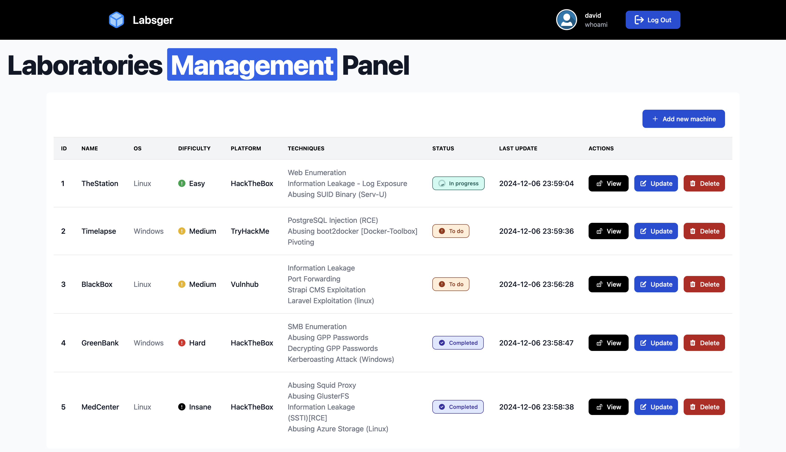
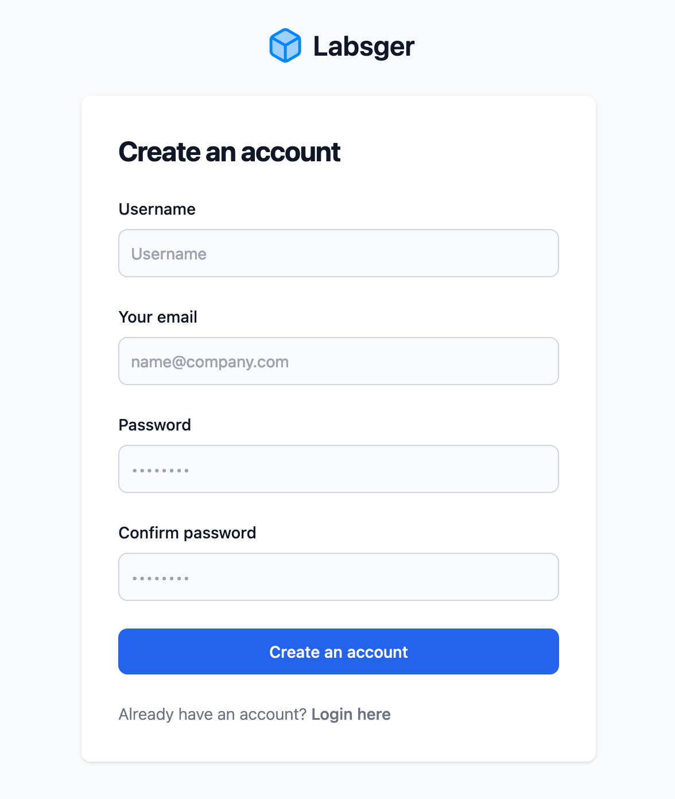
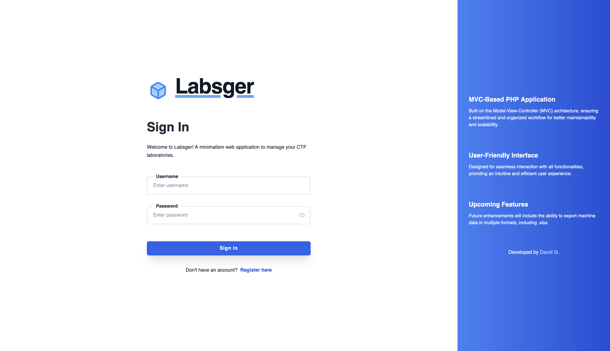
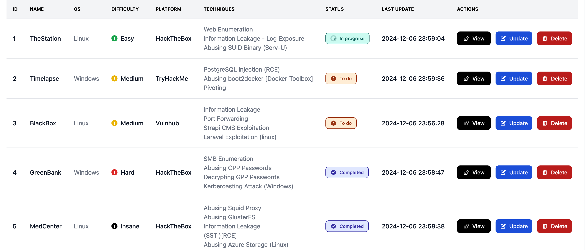
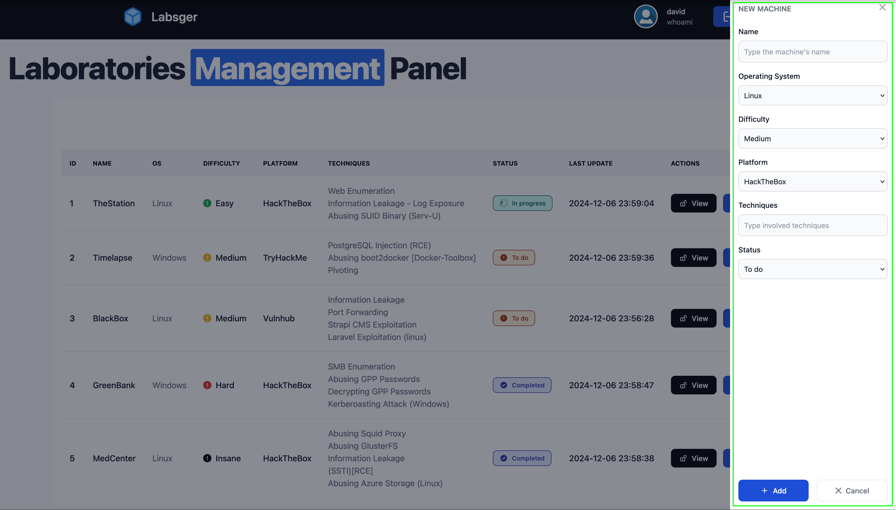
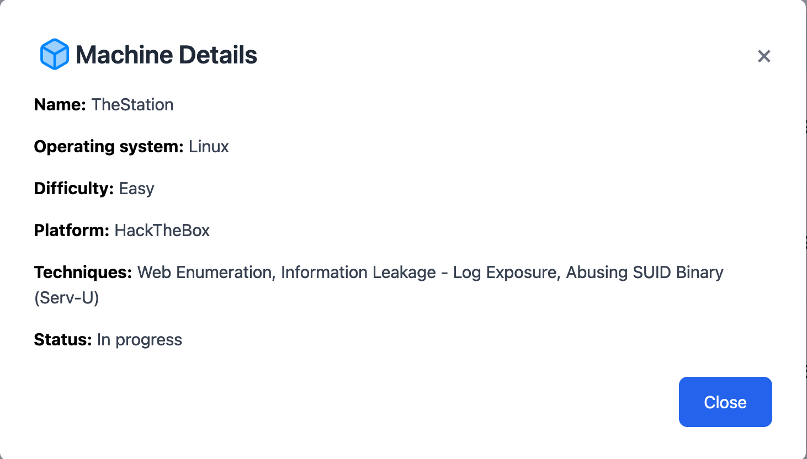
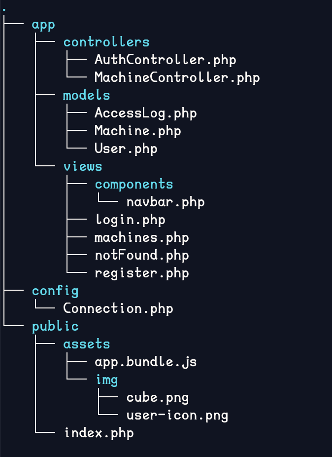

# Labsger - Hacking Laboratories Manager

 

# Overview
**Labsger** (Laboratories Manager) is a streamlined web application designed to efficiently manage hacking laboratory data in a centralized and organized manner. Built on the MVC architecture, it offers an intuitive, user-friendly interface for seamless interaction with lab information while ensuring a structured workflow. Whether you're a penetration tester or a Capture The Flag (CTF) enthusiast, Labsger helps you stay on top of your lab activities and track data effectively, enhancing your productivity and organization.

## Features 📖
- **Security:** Secure user registration and login processes, along with detailed access logs to track changes and interactions with lab data.
- **Usability:** An intuitive, user-friendly interface that ensures seamless navigation and interaction with the application.
- **Efficient Workflow:** Streamlined workflows designed to enhance productivity and facilitate easy management of tasks.
- **Centralized Data Management:** Full database integration for managing and storing laboratory data in a centralized, organized way.

## Technologies 🧰
- **Server:** Apache/2.4.56
- **Database:** MySQL
- **Backend programming language:** PHP 8.2.4
- **Frontend:** Tailwind CSS v3.0
  
## Installation ⚙️
### Pre-requisites
- Download and install XAMPP.
- Install PHP last version on your device

### Procedure
1. Clone or download the repository

2. Unzip the project if it's needed, then move the project's directory *labsger-app* to the *XAMPP/htdocs* folder

3. Once the services are running you need to create and configure the database by doing the following
  - Go to *http://localhost/phpmyadmin* on the browser
  - Create a new database
  - Inside the database use the following [queries](docs/db-queries.txt) to set up the required tables.
  - Configure a new user with a secure password to set a db connection later.

4. Open the project using a code editor of your preference and go to */labsger-app/config/Connection.php*, once there replace your db name and user credentials based on the configured in the previous step.

5. Now, you should be able to use **Labsger** from the browser by going to the following URL: *http://localhost/labsger-app/**

## Application preview 🖥️

#### Registration panel

  

#### Login panel

  

#### Laboratories Management panel

  

#### Add/Update machine form

  

## Upcoming updates
- **Data export: ** Exporting machine data to CSV and XLSX formats for easy extraction and analysis of laboratory data in a portable format.
- **Integration with hacking platforms: ** Integrating with popular hacking platforms and CTF challenges to enhance tracking and management of laboratory activities, linking the app with real-time challenges and data.
- **AI-Powered Lab report generation: ** Automatically generated summary reports based on the techniques used in the laboratory and the associated linked data.

## Annexes 📎
<table>
  <tr>
    <td style="text-align: center;">
      
      
Machine details view

    </td>
    <td style="text-align: center;">
      
      
Project structure

    </td>
  </tr>
</table>

---

**Author:** @birdm4nw

 
 
